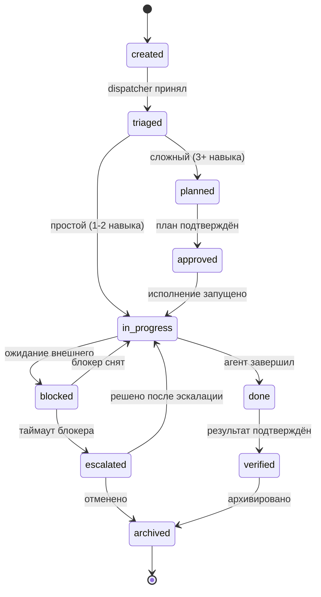

# Pepino Pick Agent OS v2 -- Task State Machine

Формальный жизненный цикл каждого кейса (CASE-YYYYMMDD-XXX).
Все агенты и скиллы ОБЯЗАНЫ следовать этому автомату состояний.

---

## Диаграмма состояний



---

## Маппинг на колонки листа "Кейсы"

| Колонка Sheets      | Поле State Machine  | Пример значения               |
| ------------------- | ------------------- | ----------------------------- |
| A: case_id          | id                  | CASE-20260321-AGR             |
| B: дата создания    | created_at          | 2026-03-21T09:15:00-03:00     |
| C: intent           | intent              | agronomy / harvest-log        |
| D: суффикс          | intent_suffix       | -AGR                          |
| E: навыки           | assigned_skills     | pepino-agro-ops, sheets       |
| F: статус           | **state**           | in_progress                   |
| G: ответственный    | owner               | roman / agent-id              |
| H: описание         | summary             | Журнал сбора зона B           |
| I: сложность        | complexity          | L1 / L2 / L3                  |
| J: approval_status  | approval            | pending / approved / na       |
| K: результат        | outcome             | 12.5 kg собрано, записано     |
| L: закрыт           | is_closed           | да / нет                      |
| M: state_changed_at | last_transition_at  | 2026-03-21T10:02:00-03:00     |
| N: blocked_reason   | blocker_description | Ожидание данных от поставщика |
| O: escalated_to     | escalation_target   | shadow-ceo / roman            |
| P: verified_by      | verifier            | roman / auto                  |
| Q: lessons_learned  | learning_record_ref | LEARN-20260321-001            |

---

## Детали каждого состояния

### CREATED

Входная точка. Каждый запрос пользователя или cron-триггер создает новый кейс.

| Параметр         | Значение                                                           |
| ---------------- | ------------------------------------------------------------------ |
| **Кто создает**  | Любой источник: пользователь (Telegram), cron, алерт, API          |
| **Условия**      | Нет -- любой запрос порождает кейс                                 |
| **Side effects** | 1. Генерация CASE-ID (CASE-YYYYMMDD-XXX)                           |
|                  | 2. Запись строки в Sheets "Кейсы" со статусом `created`            |
|                  | 3. Лог в Telegram: `Новый кейс: [CASE-ID] -- [краткое описание]`   |
| **Таймаут**      | 1 час -- если за 1h не перешёл в `triaged`, диспетчер авто-триажит |
| **Следующее**    | `triaged`                                                          |

---

### TRIAGED

Диспетчер определил intent, выбрал навыки, оценил сложность.

| Параметр          | Значение                                                       |
| ----------------- | -------------------------------------------------------------- |
| **Кто триггерит** | `pepino-dispatcher` (автоматически)                            |
| **Условия**       | CASE-ID существует, intent определён, навыки назначены         |
| **Side effects**  | 1. Обновить Sheets: intent, суффикс, навыки, сложность (L1-L3) |
|                   | 2. L3 кейсы: уведомление в Telegram о сложности                |
|                   | 3. Severity >= 3: запись в "Алерты"                            |
| **Таймаут**       | 2 часа -- алерт пользователю в Telegram                        |
| **Следующее**     | `planned` (если L3: 3+ навыка) или `in_progress` (если L1-L2)  |

**Правила маршрутизации (complexity):**

| Сложность | Критерий                     | Маршрут                |
| --------- | ---------------------------- | ---------------------- |
| L1        | 1 навык, рутинная операция   | triaged -> in_progress |
| L2        | 2 навыка, последовательно    | triaged -> in_progress |
| L3        | 3+ навыка или рабочая группа | triaged -> planned     |

---

### PLANNED

Для сложных задач (L3) создаётся план исполнения.

| Параметр          | Значение                                                         |
| ----------------- | ---------------------------------------------------------------- |
| **Кто триггерит** | `pepino-dispatcher` (для L3) или `pepino-shadow-ceo` (стратегия) |
| **Условия**       | Кейс L3 или стратегический (severity >= 3)                       |
| **Side effects**  | 1. Сформировать пошаговый план: навыки, порядок, зависимости     |
|                   | 2. Записать план в Sheets (колонка H -- расширенное описание)    |
|                   | 3. Уведомление в Telegram: "План для [CASE-ID] готов, подтверди" |
| **Таймаут**       | 4 часа -- эскалация на `pepino-shadow-ceo`                       |
| **Следующее**     | `approved`                                                       |

---

### APPROVED

Человек (или политика auto-approve) подтвердил план исполнения.

| Параметр          | Значение                                                      |
| ----------------- | ------------------------------------------------------------- |
| **Кто триггерит** | Пользователь (ответ "подтверждаю" / "да" / "ок")              |
|                   | Auto-approve: L1-действия по policy_engine (risk <= 3)        |
| **Условия**       | План существует, пользователь дал подтверждение               |
| **Side effects**  | 1. Записать approval_status = `approved`, timestamp, approver |
|                   | 2. Лог в "Решения" если strategic                             |
| **Таймаут**       | 24 часа -- напоминание в Telegram ("Ожидаю подтверждения")    |
| **Следующее**     | `in_progress`                                                 |

**Auto-approve матрица (ссылка на POLICY_ENGINE.md):**

| Действие                  | Уровень | Auto-approve? |
| ------------------------- | ------- | ------------- |
| Запись в журнал           | L1      | Да            |
| Чтение отчёта             | L1      | Да            |
| Расчёт без записи         | L1      | Да            |
| Изменение цены            | L2      | Нет           |
| Отправка КП клиенту       | L2      | Нет           |
| Капитальные расходы > 50K | L3      | Нет           |
| Изменение стратегии       | L3      | Нет           |

---

### IN_PROGRESS

Агенты выполняют задачу.

| Параметр          | Значение                                                 |
| ----------------- | -------------------------------------------------------- |
| **Кто триггерит** | Система (после triaged для L1-L2, после approved для L3) |
| **Условия**       | Approval получен (или не требовался)                     |
| **Side effects**  | 1. Статус Sheets = `in_progress`                         |
|                   | 2. Progress-обновления в Telegram (для длительных задач) |
|                   | 3. Каждый навык логирует свои шаги в кейс                |
| **Таймаут**       | Зависит от домена (см. таблицу ниже)                     |
| **Следующее**     | `done` или `blocked`                                     |

**Таймауты по доменам:**

| Домен           | SLA (таймаут) | При превышении            |
| --------------- | ------------- | ------------------------- |
| Агрономия (AGR) | 1 час         | Алерт + предложить помощь |
| Финансы (FIN)   | 4 часа        | Алерт                     |
| Продажи (COM)   | 8 часов       | Напоминание клиенту       |
| Логистика (LOG) | 2 часа        | Алерт + альтернативы      |
| Стратегия (STR) | 24 часа       | Эскалация на shadow-ceo   |
| Инженерия (ENG) | 4 часа        | Алерт                     |

---

### BLOCKED

Исполнение приостановлено из-за внешней зависимости.

| Параметр          | Значение                                                        |
| ----------------- | --------------------------------------------------------------- |
| **Кто триггерит** | Исполняющий агент (любой из назначенных навыков)                |
| **Условия**       | Недостающие данные, задержка поставщика, ожидание approval      |
| **Side effects**  | 1. Статус Sheets = `blocked`, заполнить blocked_reason (кол. N) |
|                   | 2. Алерт в Telegram: "Кейс [ID] заблокирован: [причина]"        |
|                   | 3. Добавить запись в "Алерты" при severity >= 3                 |
| **Таймаут**       | 48 часов -- эскалация                                           |
| **Следующее**     | `in_progress` (блокер снят) или `escalated` (таймаут)           |

**Категории блокеров:**

| Тип блокера         | Пример                 | Typical resolution |
| ------------------- | ---------------------- | ------------------ |
| data_missing        | Нет цены поставщика    | Запрос поставщику  |
| supplier_delay      | Субстрат задерживается | Альтернативы       |
| approval_pending    | CEO не подтвердил план | Напоминание        |
| external_dependency | SENASA ответ           | Ожидание           |
| technical_failure   | API недоступен         | Retry / fallback   |

---

### ESCALATED

Кейс требует вмешательства на более высоком уровне.

| Параметр          | Значение                                                        |
| ----------------- | --------------------------------------------------------------- |
| **Кто триггерит** | Автоматически (таймаут), агент (risk > 6), пользователь         |
| **Условия**       | Таймаут blocked (48h), risk-score > 6, или критический блокер   |
| **Side effects**  | 1. Статус Sheets = `escalated`, заполнить escalated_to (кол. O) |
|                   | 2. Уведомление shadow-ceo + пользователю                        |
|                   | 3. Запись в "Алерты" с severity = max(текущий, 4)               |
|                   | 4. Пометка в weekly review как "требовал эскалации"             |
| **Таймаут**       | 24 часа -- повторный алерт                                      |
| **Следующее**     | `in_progress` (решено) или `archived` (отменено)                |

---

### DONE

Агенты завершили исполнение.

| Параметр          | Значение                                                        |
| ----------------- | --------------------------------------------------------------- |
| **Кто триггерит** | Исполняющий агент (последний в цепочке)                         |
| **Условия**       | Все шаги плана выполнены, результат записан                     |
| **Side effects**  | 1. Статус Sheets = `done`, заполнить результат (кол. K)         |
|                   | 2. Уведомление в Telegram: "Кейс [ID] выполнен: [краткий итог]" |
|                   | 3. Обновить связанные листы (Инвентарь, P&L и т.д.)             |
| **Таймаут**       | 48 часов -- авто-верификация для L1 с risk <= 2                 |
| **Следующее**     | `verified`                                                      |

---

### VERIFIED

Результат подтверждён -- человеком или автоматически.

| Параметр          | Значение                                                   |
| ----------------- | ---------------------------------------------------------- |
| **Кто триггерит** | Пользователь ("ок" / "подтверждаю результат")              |
|                   | Auto-verify: L1-кейсы с risk <= 2 после 48h в `done`       |
| **Условия**       | Кейс в статусе `done`, результат записан                   |
| **Side effects**  | 1. Статус Sheets = `verified`, verified_by (кол. P)        |
|                   | 2. Генерация learning record (см. LEARNING_LOOP.md)        |
|                   | 3. Если severity >= 2 или amount >= 100K ARS: обязательный |
|                   | post-decision review                                       |
| **Таймаут**       | 7 дней -- авто-архивация                                   |
| **Следующее**     | `archived`                                                 |

---

### ARCHIVED

Терминальное состояние. Кейс завершён, доступен для поиска и аналитики.

| Параметр          | Значение                                                |
| ----------------- | ------------------------------------------------------- |
| **Кто триггерит** | Автоматически (7d после verified) или вручную           |
| **Условия**       | Кейс в `verified` и таймаут истёк, или ручная архивация |
| **Side effects**  | 1. Статус Sheets = `archived`, is_closed = "да"         |
|                   | 2. Если стратегический: запись в Obsidian               |
|                   | 3. Данные доступны для learning loop агрегации          |
|                   | 4. Обновить метрики агента (accuracy, speed)            |
| **Таймаут**       | Нет -- терминальное состояние                           |
| **Следующее**     | Нет                                                     |

---

## Примеры сценариев

### Сценарий 1: Простой журнал сбора урожая

Общее время: 2-5 минут.

```
09:15  created    "Собрали 12.5 кг вешенки в зоне B"
                  → CASE-20260321-AGR, intent=harvest-log
09:15  triaged    L1 (1 навык: pepino-agro-ops)
                  → auto-approve (L1, risk=1)
09:15  in_progress  pepino-agro-ops записывает в Sheets
09:16  done       "12.5 кг записано в Урожай, обновлён Инвентарь"
09:16  verified   auto-verify (L1, risk=1) через 48h
         ...
7 дней  archived  авто-архивировано
```

### Сценарий 2: Изменение цены

Общее время: 2-8 часов.

```
10:00  created    "Поднять цену вешенки с 3500 до 4000 ARS/kg"
                  → CASE-20260321-FIN
10:00  triaged    L3 (3 навыка: profit-engine, sales-crm, demand-oracle)
10:01  planned    План:
                    1. profit-engine: расчёт новой маржи
                    2. demand-oracle: прогноз влияния на спрос
                    3. sales-crm: подготовка уведомлений клиентам
                  → Telegram: "План готов, подтверди"
10:30  approved   Пользователь: "подтверждаю"
10:30  in_progress  Навыки выполняют последовательно
11:15  done       "Маржа +14%, прогноз: спрос -5%, уведомления готовы"
                  → Telegram: результат
11:20  verified   Пользователь: "ок, рассылай"
7 дней  archived  авто-архивировано
```

### Сценарий 3: Запуск нового SKU (грибной паштет)

Общее время: 1-3 недели.

```
Пн 09:00   created     "Запустить новый SKU: грибной паштет"
                        → CASE-20260310-STR
Пн 09:01   triaged     L3 (5+ навыков: sales-crm, procurement, profit-engine,
                        brand, qa-food-safety, demand-oracle)
Пн 09:05   planned     План на 12 шагов:
                          1. Рецептура и себестоимость
                          2. Поставщик ингредиентов
                          3. SENASA регистрация
                          4. Ценообразование
                          5. Брендинг и этикетка
                          ...
Пн 09:30   approved    Пользователь: "поехали"
Пн 09:30   in_progress Навыки запущены параллельно (где возможно)
Ср 14:00   blocked     "Поставщик специй не отвечает 48 часов"
                        → blocked_reason=supplier_delay
                        → Telegram: алерт
Пт 10:00   escalated   Таймаут 48h, escalated_to=shadow-ceo
                        → shadow-ceo предлагает альтернативного поставщика
Пт 11:00   in_progress Блокер снят: найден альтернативный поставщик
Пн+2 16:00 done        Все 12 шагов завершены
Пн+2 17:00 verified    Пользователь: "SKU готов к продаже"
+7 дней     archived   Learning record: "supplier_delay стоил 2 дня,
                        добавить backup поставщиков в procurement"
```

---

## Валидация переходов

Агенты НЕ МОГУТ выполнять произвольные переходы. Допустимые переходы:

```
created      -> triaged
triaged      -> planned, in_progress
planned      -> approved
approved     -> in_progress
in_progress  -> done, blocked
blocked      -> in_progress, escalated
escalated    -> in_progress, archived
done         -> verified
verified     -> archived
```

Любой другой переход -- ошибка. Агент обязан залогировать попытку невалидного
перехода в "Алерты" с severity=3 и сообщить пользователю.

---

## Таймаут-движок (Cron)

Cron-задача проверяет просроченные кейсы каждые 30 минут:

```python
# Псевдокод таймаут-движка
TIMEOUTS = {
    "created":     timedelta(hours=1),
    "triaged":     timedelta(hours=2),
    "planned":     timedelta(hours=4),
    "approved":    timedelta(hours=24),
    "in_progress": None,  # зависит от домена, см. таблицу выше
    "blocked":     timedelta(hours=48),
    "escalated":   timedelta(hours=24),
    "done":        timedelta(hours=48),
    "verified":    timedelta(days=7),
}

for case in get_cases_not_archived():
    state = case.state
    timeout = TIMEOUTS[state]
    if timeout and (now - case.last_transition_at) > timeout:
        execute_timeout_action(case, state)
```

**Действия по таймауту:**

| Состояние   | Действие при таймауте                         |
| ----------- | --------------------------------------------- |
| created     | Авто-триаж диспетчером                        |
| triaged     | Алерт пользователю в Telegram                 |
| planned     | Эскалация на shadow-ceo                       |
| approved    | Напоминание пользователю                      |
| in_progress | Алерт (по SLA домена)                         |
| blocked     | Эскалация                                     |
| escalated   | Повторный алерт shadow-ceo + пользователю     |
| done        | Авто-verify для L1 risk<=2, иначе напоминание |
| verified    | Авто-архивация                                |
